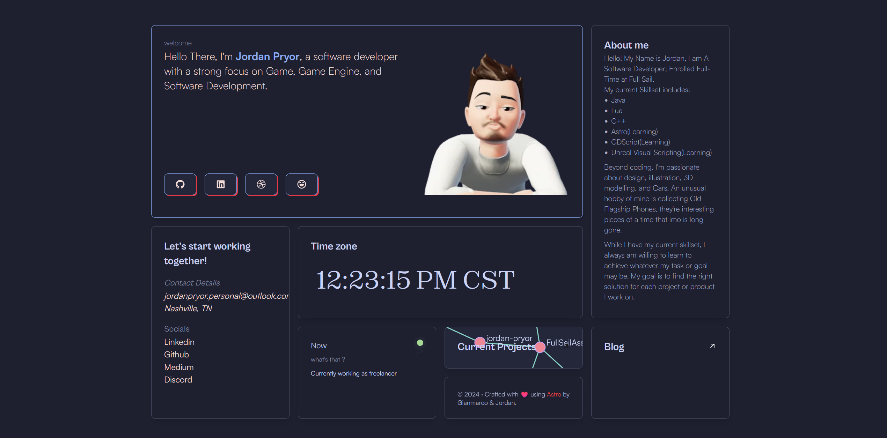

# ⚡️jordan-pryorPortfolio

## A personal portfolio website made using `Astro`.



To view my portfolio, **[click here](https://jordan-pryor.netlify.app/)**

## Features

- Modern and Minimal bento-like, sleek UI Design
- All in one page (almost)
- Fully Responsive
- Performance and SEO optimizations
- Ready to be deployed on [Netlify](https://www.netlify.com/)
- Blog
- RSS support (your-domain/rss.xml)
- Cool Reactive Web, for All your github Repos!
- Cool Reactive Timeline, showing your activity!

## Tech Stack

- [Astro](https://astro.build)
- [unocss](https://unocss.dev/)
- [motion](https://motion.dev/)
- [d3](https://d3js.org/)

# Steps ▶️

```bash
# Clone this repository
$ git clone https://github.com/yourusername/jordan-pryorPortfolio
```

```bash
# Go into the repository
$ cd jordan-pryorPortfolio
```

```bash
# Install dependencies
$ pnpm install
or
$ npm install
```

```bash
# Start the project in development
$ pnpm run dev
or
$ npm run dev
```

## REMOVE THE umami analytics script tag (or replace it with your id) in `src/layouts/Layout.astro`

# Configuration

Remember to replace the `site` and other properties with your data in `astro.config.mjs`

# Deploy on Netlify 🚀

Deploying your website on Netlify is optional but recommended for faster and easier deployment.

You just need to fork this repo and link it to your Netlify account.

or

[](https://app.netlify.com/start/deploy?repository=https://github.com/yourusername/jordan-pryorPortfolio)

## Authors ❤️

- Jordan Pryor - https://github.com/yourusername
- Based on the template by Gianmarco - https://github.com/Ladvace

## Credits

- Color scheme inspired by [Catppuccin Macchiato](https://github.com/catppuccin/catppuccin)
- Template originally created by [astro-bento-portfolio](https://github.com/Ladvace/astro-bento-portfolio)
